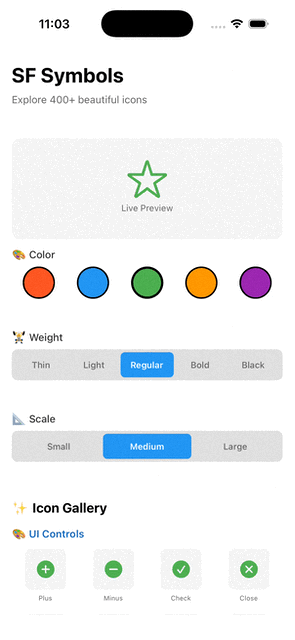

# 🎨 react-native-nitro-sfsymbols

> 🍎 Render Apple's beautiful **SF Symbols** natively on iOS with React Native. Zero-bridge overhead, fully typed, production-ready.

<div align="center">

[](https://www.npmjs.com/package/react-native-nitro-sfsymbols)
[](https://opensource.org/licenses/MIT)
[](https://www.typescriptlang.org/)
[](https://reactnative.dev/)
[](https://nitro.margelo.com/)
[](./src/__tests__/)

[📖 Documentation](#usage) • [🎯 Examples](#examples) • [🚀 Performance](#performance) • [📝 API Reference](#api-reference)

</div>

---

## ✨ Features

<table>
<tr>
<td>

### 🎯 Core
- 🍎 Native SF Symbols on iOS, macOS, tvOS, visionOS
- 📦 Fully type-safe TypeScript
- 🚀 Nitro Modules (zero-bridge overhead)
- 📏 Minimal bundle size (~5KB)
- ♿ Full accessibility support

</td>
<td>

### 🎨 Customization
- 📐 Any size in points
- 💪 9 weight levels
- 📏 3 scale variants
- 🌈 Multiple color modes
- 💫 Animations (iOS 17+)
- 🔄 Variable colors (iOS 16+)

</td>
</tr>
</table>

---

## 🚀 Quick Start

### 📦 Installation

```bash
npm install react-native-nitro-sfsymbols react-native-nitro-modules
```

or

```bash
yarn add react-native-nitro-sfsymbols react-native-nitro-modules
```

> [!IMPORTANT]
> `react-native-nitro-modules` is required. Learn more at [nitro.margelo.com](https://nitro.margelo.com/)

### ⚙️ Setup

```bash
cd ios && pod install
```

### 🌍 Platform Support

| Platform | Support | Minimum Version | Notes |
|----------|---------|-----------------|-------|
| 📱 iOS | ✅ Full | 13.0 | Complete SF Symbols support |
| 🖥️ macOS | ✅ Full | 11.0 | Desktop SF Symbols support |
| 📺 tvOS | ✅ Full | 13.0 | TV app SF Symbols support |
| 👓 visionOS | ✅ Full | 1.0 | Spatial computing SF Symbols |
| 🤖 Android | ⚠️ Stub | - | Framework ready, requires Material Icons alternative |

---

### 💡 Basic Usage

```tsx
import { SFSymbolView, SFIcons } from 'react-native-nitro-sfsymbols';

export function App() {
  return (
    <SFSymbolView 
      name={SFIcons.HEART_FILL}
      size={32}
      tintColor="#FF5722"
    />
  );
}
```

---

## 🎬 Live Demo

<div align="center">



*Interactive example showcasing color, weight, and scale customization with 400+ available SF Symbols*

</div>

---

## 📚 Usage

### 🎨 Simple Rendering

```tsx
import { SFSymbolView, SFIcons } from 'react-native-nitro-sfsymbols';

<SFSymbolView 
  name={SFIcons.THERMOMETER_SUN_FILL}
  size={32}
  tintColor="#FF5722"
/>
```

### 📏 Available Symbols

The library includes **400+ curated SF Symbol names** organized into 23 categories:

```tsx
// 🌦️ Weather (15 icons)
SFIcons.THERMOMETER_SUN_FILL
SFIcons.CLOUD_RAIN_FILL
SFIcons.WIND_SNOW

// 🎮 UI Controls (25 icons)
SFIcons.HEART_FILL
SFIcons.STAR_FILL
SFIcons.CHECKMARK_CIRCLE_FILL
SFIcons.XMARK_CIRCLE_FILL

// 🧭 Navigation (30 icons)
SFIcons.CHEVRON_LEFT
SFIcons.ARROW_UP_RIGHT
SFIcons.ARROW_CLOCKWISE
SFIcons.LOCATION_FILL

// 📁 Files (25 icons)
SFIcons.FOLDER_FILL
SFIcons.FILE_FILL
SFIcons.TRASH_FILL

// ... and 400+ more!
```

> [!TIP]
> **Complete Icon List:** See [`src/icons.ts`](./src/icons.ts) for the full TypeScript enum with all **400+ available symbols** organized by category.

## 🎯 Complete Iconography

> [!IMPORTANT]
> 📖 **Browse All 400+ Icons**: Open [`src/icons.ts`](./src/icons.ts) for the comprehensive, type-safe enum of all available SF Symbols organized into 23 categories:
> 
> - 🌦️ Weather (15 icons)
> - 🧭 Navigation & Arrows (30 icons)  
> - 🎮 UI Controls (25 icons)
> - 📱 Media & Playback (20 icons)
> - 📤 Share & Action (15 icons)
> - 💬 Communication (20 icons)
> - 🔍 Search & Settings (15 icons)
> - 👤 User & Account (20 icons)
> - 🔐 Security & Protection (15 icons)
> - 📁 File & Document (25 icons)
> - 🛒 Commerce & Shopping (20 icons)
> - ❤️ Activity & Health (31 icons)
> - 🔔 Notification & Alert (12 icons)
> - 🗺️ Maps & Location (20 icons)
> - ⏰ Time & Date (15 icons)
> - 🔷 Shapes & Symbols (20 icons)
> - 📐 Grid & Layout (12 icons)
> - ✏️ Text & Editing (18 icons)
> - 🖼️ Image & Media (15 icons)
> - 🔊 Audio & Music (12 icons)
> - 🔧 Utilities & Tools (20 icons)
> - 🔢 Numbers & Symbols (10 icons)
> - 🎛️ Additional UI Elements (15 icons)
>
> **👉 [View Complete List with All 400+ Icons →](./src/icons.ts)**

---

## 📚 Usage

### ⚖️ Weight Customization

Choose from 9 weight levels:

```tsx
import { SFSymbolView, SFSymbolWeight } from 'react-native-nitro-sfsymbols';

<SFSymbolView 
  name={SFIcons.STAR_FILL}
  size={40}
  weight={SFSymbolWeight.BOLD}
  tintColor="#FFD700"
/>
```

**Available weights:**
- `ULTRALIGHT` (100) — Hairline thin
- `THIN` (200)
- `LIGHT` (300)
- `REGULAR` (400) — Default
- `MEDIUM` (500)
- `SEMIBOLD` (600)
- `BOLD` (700)
- `HEAVY` (800)
- `BLACK` (900) — Maximum weight

### 📏 Scale Variants

```tsx
import { SFSymbolView, SFSymbolScale } from 'react-native-nitro-sfsymbols';

<SFSymbolView 
  name={SFIcons.BELL_FILL}
  size={24}
  scale={SFSymbolScale.LARGE}
/>
```

**Available scales:** `SMALL` • `MEDIUM` • `LARGE`

### 🌈 Rendering Modes

#### Monochrome (Default) 🎨

```tsx
<SFSymbolView 
  name={SFIcons.FOLDER_FILL}
  size={32}
  tintColor="#2196F3"
  renderingMode={SFSymbolRenderingMode.MONOCHROME}
/>
```

#### Hierarchical 📊

```tsx
import { SFSymbolRenderingMode } from 'react-native-nitro-sfsymbols';

<SFSymbolView 
  name={SFIcons.FOLDER_FILL}
  size={32}
  renderingMode={SFSymbolRenderingMode.HIERARCHICAL}
  hierarchical={{
    primaryColor: '#FF5722',
    secondaryColor: '#FF8A65',
    tertiaryColor: '#FFAB91'
  }}
/>
```

#### Palette 🎭

```tsx
<SFSymbolView 
  name={SFIcons.PERSON_3_FILL}
  size={32}
  renderingMode={SFSymbolRenderingMode.PALETTE}
  palette={{
    primaryColor: '#2196F3',
    secondaryColor: '#4CAF50',
    tertiaryColor: '#FFB300'
  }}
/>
```

### 🎬 Advanced Features

#### Opacity 👻

```tsx
<SFSymbolView 
  name={SFIcons.HEART_FILL}
  size={24}
  opacity={0.6}
/>
```

#### Variable Colors (iOS 16+) 🎨

```tsx
<SFSymbolView 
  name={SFIcons.STAR_FILL}
  size={32}
  variableColor={true}
/>
```

#### Animations (iOS 17+) ✨

```tsx
<SFSymbolView 
  name={SFIcons.BELL_FILL}
  size={32}
  animation={{
    enabled: true,
    type: 'bounce',
    repeating: true
  }}
/>
```

### ♿ Accessibility

```tsx
<SFSymbolView 
  name={SFIcons.HEART_FILL}
  size={24}
  tintColor="#E91E63"
  accessibilityLabel="Add to favorites"
  accessibilityHint="Double tap to add this item to your favorites"
/>
```

### 🔧 Utility Functions

#### Validate Symbols

```tsx
import { isValidSFIcon, getAllSFIcons } from 'react-native-nitro-sfsymbols';

if (isValidSFIcon('heart.fill')) {
  // render symbol
}

const allIcons = getAllSFIcons(); // Get all available symbols
```

#### Search Symbols

```tsx
import { searchSFIcon } from 'react-native-nitro-sfsymbols';

const icon = searchSFIcon('thermometer'); // Find matching icon
```

#### Size Presets

```tsx
import { getPresetSize } from 'react-native-nitro-sfsymbols';

const size = getPresetSize('large'); // 32pt
```

### 🌐 Cross-Platform Usage

Since SF Symbols are iOS-only, use platform detection:

```tsx
import { Platform } from 'react-native';
import { SFSymbolView, SFIcons } from 'react-native-nitro-sfsymbols';
import MaterialIcon from '@react-native-material/core';

export function Icon({ name }) {
  if (Platform.OS === 'ios') {
    return <SFSymbolView name={name} size={24} />;
  }
  
  // Use Material Icons on Android
  return <MaterialIcon name={name} size={24} />;
}
```

---

## 📊 API Reference

### SFSymbolView Props

| Prop | Type | Default | Description |
|------|------|---------|-------------|
| `name` ⭐ | `SFIcons` | Required | SF Symbol name |
| `size` | `number` | `24` | Size in points |
| `weight` | `SFSymbolWeight` | `REGULAR` | Stroke weight (9 levels) |
| `scale` | `SFSymbolScale` | `MEDIUM` | Scale variant |
| `tintColor` | `string` | `#000000` | Hex color |
| `renderingMode` | `SFSymbolRenderingMode` | `MONOCHROME` | Color rendering mode |
| `hierarchical` | `object` | `undefined` | Hierarchical colors |
| `palette` | `object` | `undefined` | Palette colors |
| `animation` | `object` | `undefined` | Animation config (iOS 17+) |
| `opacity` | `number` | `1` | Opacity 0-1 |
| `variableColor` | `boolean` | `false` | Variable colors (iOS 16+) |
| `reduceComplexity` | `boolean` | `false` | Reduce for low-end devices |
| `accessibilityLabel` | `string` | `undefined` | Screen reader label |
| `accessibilityHint` | `string` | `undefined` | Screen reader hint |

### Types & Enums

```typescript
// Symbol names
SFIcons.HEART_FILL
SFIcons.STAR_FILL
SFIcons.THERMOMETER_SUN_FILL
// ... 100+ more

// Weight levels
SFSymbolWeight.ULTRALIGHT | THIN | LIGHT | REGULAR | MEDIUM | SEMIBOLD | BOLD | HEAVY | BLACK

// Scales
SFSymbolScale.SMALL | MEDIUM | LARGE

// Rendering modes
SFSymbolRenderingMode.MONOCHROME | HIERARCHICAL | PALETTE | MULTICOLOR
```

---

## 🚀 Performance

This library is **optimized for performance**:

- ✅ Native UIImageView rendering
- ✅ Nitro Modules (zero-bridge overhead)
- ✅ Tree-shaking friendly
- ✅ Memoized props
- ✅ ~5KB bundle size (gzipped)

---

## 💻 Platform Support

| Platform | Minimum Version | Status | Notes |
|----------|-----------------|--------|-------|
| 🍎 iOS | 13.0 | ✅ Full | Complete SF Symbols support with all features |
| 🖥️ macOS | 11.0 | ✅ Full | Desktop SF Symbols with native rendering |
| 📺 tvOS | 13.0 | ✅ Full | TV app SF Symbols optimized for tvOS |
| 👓 visionOS | 1.0 | ✅ Full | Spatial computing with SF Symbols |
| 🤖 Android | All | ⚠️ Stubs | Framework ready, no native SF Symbols support |

> [!WARNING]
> **Android Note**: SF Symbols are exclusive to Apple's platforms (iOS, macOS, tvOS, visionOS). On Android, this library provides placeholder stubs to prevent crashes. Use [Material Design Icons](https://fonts.google.com/icons) instead.

---

## 🏗️ Platform-Specific Notes

### 📱 iOS (13.0+)

Full native support for all SF Symbols features:
- ✅ All 400+ SF Symbols available
- ✅ Weight, scale, and rendering modes
- ✅ Color customization and hierarchical colors
- ✅ Animations (iOS 17+)

### 🖥️ macOS (11.0+)

Complete desktop support for SF Symbols:
- ✅ All iOS features available
- ✅ Optimized for larger screens
- ✅ Touch and trackpad interactions
- ✅ Support for system appearances (light/dark)

### 📺 tvOS (13.0+)

Optimized for Apple TV:
- ✅ All SF Symbols available
- ✅ Focus-based navigation support
- ✅ Larger default sizes (optimized for TV viewing)
- ✅ Simplified interactions

### 👓 visionOS (1.0+)

Built for spatial computing:
- ✅ All SF Symbols in 3D space
- ✅ Native visionOS rendering
- ✅ Gesture-based interactions
- ✅ Immersive experiences (requires visionOS 1.0+)

### 🤖 Android

This library provides **stub components** on Android:

- ✅ Prevents app crashes
- ⚠️ Shows placeholder view
- 📝 Logs helpful warnings
- 🔗 Suggests alternatives

**Alternatives for Android:**
- [Material Design Icons](https://fonts.google.com/icons)
- [React Native Vector Icons](https://github.com/oblador/react-native-vector-icons)
- [FontAwesome](https://fontawesome.com/)

---

## 🧪 Development

### 📦 Install Dependencies

```bash
yarn install
```

### 🔨 Generate Nitro Boilerplate

```bash
yarn nitrogen
```

### 🧪 Run Tests

```bash
yarn test
```

### 📋 Type Checking

```bash
yarn typecheck
```

### 🎨 Linting

```bash
yarn lint --fix
```

### 🏗️ Build

```bash
yarn prepare
```

> [!NOTE]
> Run `yarn nitrogen` after modifying `NitroSfsymbols.nitro.ts`

---

## 🤝 Contributing

Contributions are **welcome and encouraged**! 🎉

Please read [CONTRIBUTING.md](./CONTRIBUTING.md) for:
- 📋 Development workflow
- ✅ Code style guidelines
- 🧪 Testing requirements
- 📤 Pull request process
- 📖 [Code of Conduct](./CODE_OF_CONDUCT.md)

---

## 📄 License

MIT © [Mateus Andrade](https://github.com/mCodex)

<div align="center">

**[↑ back to top](#-react-native-nitro-sfsymbols)**

</div>

---

## 🔗 Resources

| Resource | Link |
|----------|------|
| 📖 SF Symbols Guide | [developer.apple.com/design/human-interface-guidelines/sf-symbols](https://developer.apple.com/design/human-interface-guidelines/sf-symbols) |
| 🎨 SF Symbols Browser | [developer.apple.com/sf-symbols](https://developer.apple.com/sf-symbols/) |
| ⚡ Nitro Modules Docs | [nitro.margelo.com](https://nitro.margelo.com/) |
| 🚀 React Native Docs | [reactnative.dev](https://reactnative.dev/) |
| 🎨 Material Icons | [fonts.google.com/icons](https://fonts.google.com/icons) |

---

<div align="center">

Made with ❤️ by [Mateus Andrade](https://github.com/mCodex)

Built with [create-react-native-library](https://github.com/callstack/react-native-builder-bob)

</div>

